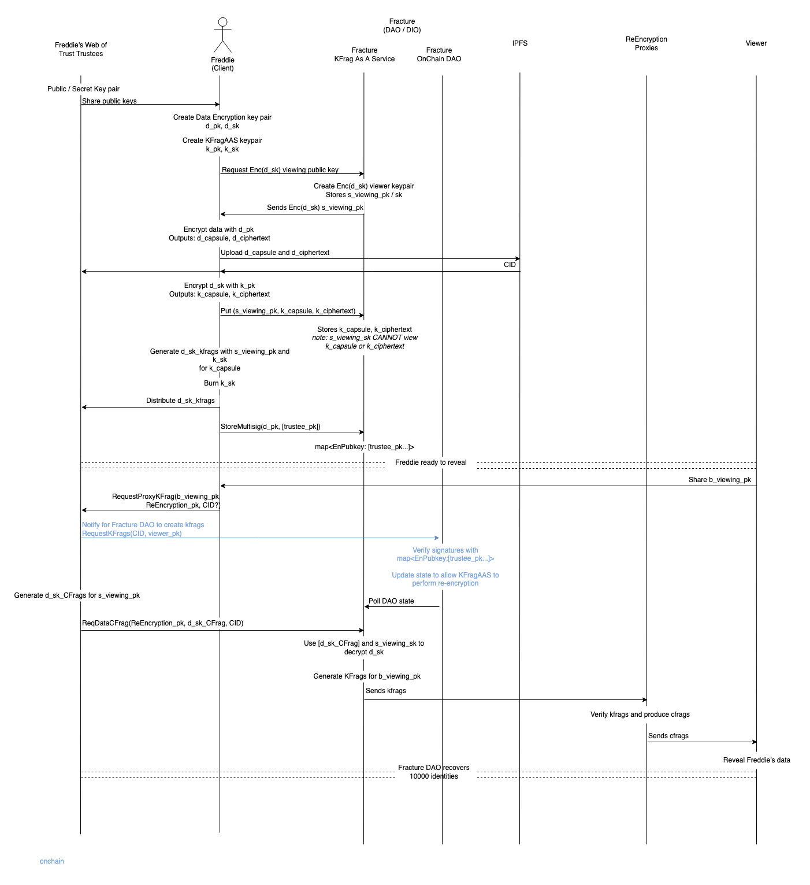

# Umbral-IPFS

X is an end to end solution for anyone to encrypt data for an undefined viewer to view in the future.

X is designed to with the following guiding principles that serves the user

- Privacy: no intemediary throughout the process will have any un-encrypted data intended for the final viewer
- Security: no intemediary throughout the process at anytime has all the information required to decrypt encrypted data
- User Protection: after initial data encryption, the user is not expected to have any data that compromises the encrypted data / identity (i.e. no private key)
- Decentralisation: any services can be distributed and performs untrusted operations

## Motivation

The UNHCR [estimates] that 84 million people are forcibly displaced globally to escape war, persecution or violence.
In many cases, it is unsafe to travel with any identification document,
to ensure their protection when they finally arrive in a destination State,
they are often [registered] by States or NGOs.

We want to provide an option for the forcibly displaced to recover their identity or any data that they may want to have from their home country without having to carry it on their journey.

Since the design of the solution, we have found that use cases for this solution are much more than expected. i.e. _TODO_

[registered]: https://www.unhcr.org/registration.html
[estimates]: https://www.unhcr.org/refugee-statistics/

## Process Flow

### Roles

- **Delegatee (Freddie)**:
- **Delegators (Freddie's web of trust trustee)**:
- **Fracture DAO - KFragaas (KFrags as a service)**:
- **Fracture DAO - Algorand DAO**:
- **Data Storage - IPFS**:
- **Delegators (Viewer's trusted agents)**:
- **Viewer (States / NGOs)**:

### Flow Diagram



# Client

> Implementing the Umbral threshold proxy re-encryption scheme with IPFS

## Usage

```
umbral_ipfs account

# Outputs (needs to be run 2x, once for sender, once for receiver):
# *_SK
# *_PK

umbral_ipfs encrypt \
  --sender-pk <SENDER_PK> \
  --plaintext <PLAINTEXT>

# Outputs:
# CAPSULE
# CIPHERTEXT

umbral_ipfs grant \
  --sender-sk <SENDER_SK> \
  --receiver-pk <RECEIVER_PK> \
  --threshold <THRESHOLD> \
  --shares <SHARES>

# Outputs:
# VERIFYING_PK
# KFRAG
# KFRAG
# ...

umbral_ipfs pre \
  --capsule-cid <CAPSULE_CID> \
  --kfrag <KFRAG> \
  --sender-pk <SENDER_PK> \
  --receiver-pk <RECEIVER_PK> \
  --verifying-pk <VERIFYING_PK>

# Outputs:
# CFRAG
# CFRAG
# ...

umbral_ipfs decrypt \
  --capsule-cid <CAPSULE_CID> \
  --ciphertext-cid <CIPHERTEXT_CID> \
  --cfrags <[CFRAG]> \
  --sender-pk <SENDER_PK> \
  --receiver-sk <RECEIVER_SK> \
  --receiver-pk <RECEIVER_PK> \
  --verifying-pk <VERIFYING_PK>

# Outputs:
# PLAINTEXT
```
